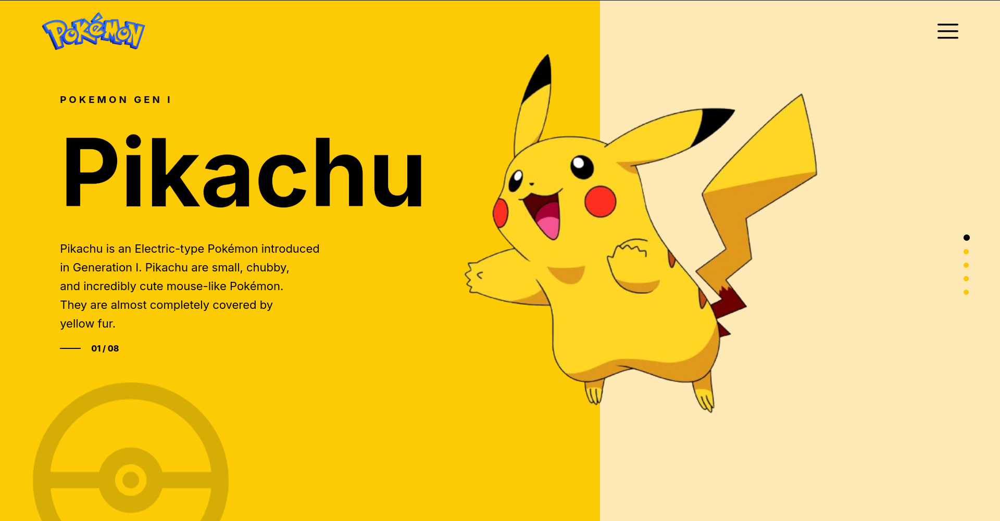

# ⚡ Pokémon UI Landing Page

A modern Pokémon-inspired landing page created using **HTML** and **CSS**.  
This project was built as part of the **Day 4 CSS Positioning Assignment** to practice real-world UI layouts using:

- `position: relative`
- `position: absolute`

The design recreates a clean and modern Pokémon landing page focused on layout positioning and UI structure.

---

# 🌐 Live Demo

🔗 Live Website:  
https://preeminent-cendol-c76fcf.netlify.app/

---

# 📸 Preview



```md

```

---

# 🎯 Assignment Objective

The main objective of this assignment was to understand how CSS positioning works in real UI designs by recreating a professional landing page layout.

This project helped in practicing:

- Absolute & Relative Positioning
- UI Layout Structuring
- Layer Management
- Spacing & Alignment
- Responsive UI Thinking

---

# 🛠️ Tech Stack

| Technology | Usage |
|------------|-------|
| HTML5 | Structure |
| CSS3 | Styling & Positioning |

---

# ✨ Features

- Modern Pokémon UI Design
- Split Background Layout
- Positioned Character Illustration
- Clean Typography
- Navigation Menu Icon
- Pagination Indicators
- Responsive Layout Structure
- Smooth Visual Alignment

---

# 📚 CSS Concepts Used

```css
position: relative;
position: absolute;
display: flex;
z-index;
transform;
```

Additional concepts:

- Flexbox
- Typography Styling
- Element Layering
- Spacing System
- UI Composition

---

# 📂 Project Structure

```bash
project-folder/
│
├── index.html
├── style.css
├── README.md
│
├── logo.png
├── menu.png
├── pikaachu.png
├── poki-ball.png
└── preview.png
```

# 🚀 Getting Started

## 1️⃣ Clone the Repository

```bash
git clone <your-repository-link>
```

## 2️⃣ Open Project

Simply open the `index.html` file in your browser.

---

# 💡 What I Learned

Through this project, I improved my understanding of:

- CSS Positioning Techniques
- Real UI Recreation
- Layout Balancing
- Absolute Positioning Workflow
- Visual Hierarchy in Web Design

---

# 🔍 Resources

- Google Search
- ChatGPT
- UI Design References
- Remix Icons

---

# 👨‍💻 Author

**prajapatihiteshkumar300369**

---

# ⭐ Feedback

If you like this project, feel free to give it a ⭐ on GitHub.